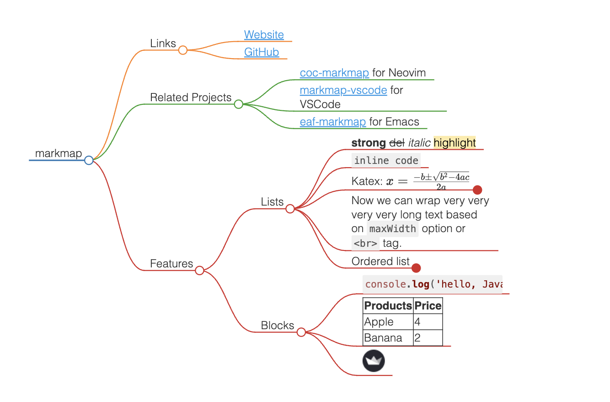

## Markmap Component for Streamlit

---

Visualize your Markdown as mindmaps.

This project is heavily inspired by  [markmap](https://github.com/markmap/markmap).

---

### Use

#### Direct add such code in your streamlit code.
```python
import streamlit.components.v1 as components

def markmap(data, height=600):
    data = str(data)
    markdown_style = '''
            <style>
                svg {{
                    width: 100%;
                    height: {}px;
                }}
            </style>'''.format(height)
    markdown_html = f'''
        {markdown_style}
        <div class="markmap">
            <script src="https://cdn.jsdelivr.net/npm/markmap-autoloader@latest"></script>
            <script type="text/template">
                {data}
            </script>
        </div>
    '''

    markmap_component = components.html(markdown_html, height=height)
    return markmap_component
```

#### Install from PyPI [Need Upgrade to New Version]
```
pip install streamlit-markmap==1.0.1
```

and modify the function `markmap` as follows:
```python
def markmap(data, height=600):
    data = str(data)
    markdown_style = '''
            <style>
                svg {{
                    width: 100%;
                    height: {}px;
                }}
            </style>'''.format(height)
    markdown_html = f'''
        {markdown_style}
        <div class="markmap">
            <script src="https://cdn.jsdelivr.net/npm/markmap-autoloader@latest"></script>
            <script type="text/template">
                {data}
            </script>
        </div>
    '''

    markmap_component = components.html(markdown_html, height=height)
    return markmap_component
```

### Example

##### 1、a simple case


```python
import streamlit as st
from streamlit_markmap import markmap

st.set_page_config(page_title="markmap", layout="wide")

with open('markdown_data/data.md', encoding='utf-8') as fp:
    md = fp.read()

markmap(md,height=400)
```

---

##### 2、a complex case

这个例子参考了[markmap](https://markmap.js.org/repl)网站案例，同时因不知使用markmap项目是否需要声明，如需可随时增加相关声明。

This example is a reference to the [markmap](https://markmap.js.org/repl) website, and as it is not known whether a declaration is required to use the markmap project, feel free to add one if you wish.



~~~python
import streamlit as st
from streamlit_markmap import markmap

st.set_page_config(page_title="markmap", layout="wide")


st.write('## example1')
with open('markdown_data/data.md', encoding='utf-8') as fp:
    md = fp.read()

markmap(md,height=400)

st.write('## example2')
data = '''
---
title: markmap
markmap:
  maxWidth: 200
  colorFreezeLevel: 2
  initialExpandLevel: 4
---

## Links

- [Website](https://markmap.js.org/)
- [GitHub](https://github.com/gera2ld/markmap)

## Related Projects

- [coc-markmap](https://github.com/gera2ld/coc-markmap) for Neovim
- [markmap-vscode](https://marketplace.visualstudio.com/items?itemName=gera2ld.markmap-vscode) for VSCode
- [eaf-markmap](https://github.com/emacs-eaf/eaf-markmap) for Emacs

## Features

Note that if blocks and lists appear at the same level, the lists will be ignored.

### Lists

- **strong** ~~del~~ *italic* ==highlight==
- `inline code`
- Katex: $x = {-b \pm \sqrt{b^2-4ac} \over 2a}$ <!-- markmap: fold -->
  - [More Katex Examples](#?d=gist:af76a4c245b302206b16aec503dbe07b:katex.md)
- Now we can wrap very very very very long text based on `maxWidth` option or `<br>` tag.
- Ordered list
  1. item 1
  2. item 2

### Blocks

```js
console.log('hello, JavaScript')
```

| Products | Price |
|-|-|
| Apple | 4 |
| Banana | 2 |


'''

markmap(data, height=400)
~~~

